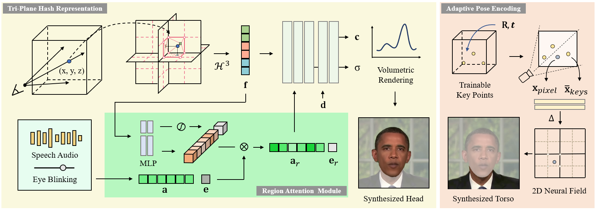

# Refining ER-NeRF for Talking Portrait Synthesis: Optimized Loss Functions and Methodological Enhancements

This code snippet is borrowed from the official repository of our ICCV 2023 paper titled **Efficient Region-Aware Neural Radiance Fields for High-Fidelity Talking Portrait Synthesis**. The code showcases the implementation of the proposed method described in the paper.

### [Paper](https://openaccess.thecvf.com/content/ICCV2023/html/Li_Efficient_Region-Aware_Neural_Radiance_Fields_for_High-Fidelity_Talking_Portrait_Synthesis_ICCV_2023_paper.html) | [Project](https://fictionarry.github.io/ER-NeRF/) | [ArXiv](https://arxiv.org/abs/2307.09323) | [Video](https://youtu.be/Gc2d3Z8MMuI)



## Abstract

This paper focuses on refining ER-NeRF for talking portrait synthesis by integrating optimized loss functions and methodological enhancements. We optimize ER-NeRF for talking portrait synthesis by optimizing loss functions and improving the model. Specifically, we explore the effects of L1, L2, and Smooth loss functions. We also explore adding an Error map and hash grid tuning. The results show that using L1 loss and Smooth Loss can improve learning and generate better results. This paper provides a systematic study on how to use these loss functions to improve the learning ability of ER-NeRF in talking portrait synthesis. Code is available at https://github.com/Kedreamix/ER-NeRF.


## Installation

Tested on Ubuntu 18.04, Pytorch 1.12 and CUDA 11.3.

### Install dependency

```bash
conda create -n ernerf python=3.10
conda install pytorch==1.12.1 torchvision==0.13.1 cudatoolkit=11.3 -c pytorch
pip install -r requirements.txt
pip install "git+https://github.com/facebookresearch/pytorch3d.git"
pip install tensorflow-gpu==2.8.0
```

### Preparation

- Prepare face-parsing model.

  ```bash
  wget https://github.com/YudongGuo/AD-NeRF/blob/master/data_util/face_parsing/79999_iter.pth?raw=true -O data_utils/face_parsing/79999_iter.pth
  ```

- Prepare the 3DMM model for head pose estimation.

  ```bash
  wget https://github.com/YudongGuo/AD-NeRF/blob/master/data_util/face_tracking/3DMM/exp_info.npy?raw=true -O data_utils/face_tracking/3DMM/exp_info.npy
  wget https://github.com/YudongGuo/AD-NeRF/blob/master/data_util/face_tracking/3DMM/keys_info.npy?raw=true -O data_utils/face_tracking/3DMM/keys_info.npy
  wget https://github.com/YudongGuo/AD-NeRF/blob/master/data_util/face_tracking/3DMM/sub_mesh.obj?raw=true -O data_utils/face_tracking/3DMM/sub_mesh.obj
  wget https://github.com/YudongGuo/AD-NeRF/blob/master/data_util/face_tracking/3DMM/topology_info.npy?raw=true -O data_utils/face_tracking/3DMM/topology_info.npy
  ```

- Download 3DMM model from [Basel Face Model 2009](https://faces.dmi.unibas.ch/bfm/main.php?nav=1-1-0&id=details):

  ```
  # 1. copy 01_MorphableModel.mat to data_util/face_tracking/3DMM/
  # 2.
    cd data_utils/face_tracking
    python convert_BFM.py
  ```

### Pre-processing Custom Training Video

* Put training video under `data/<ID>/<ID>.mp4`.

  The video **must be 25FPS, with all frames containing the talking person**. 
  The resolution should be about 512x512, and duration about 1-5 min.

* Run script to process the video. (may take several hours)

  ```bash
  python data_utils/process.py data/<ID>/<ID>.mp4
  ```

* Obtain AU45 for eyes blinking
  
  Run `FeatureExtraction` in [OpenFace](https://github.com/TadasBaltrusaitis/OpenFace), rename and move the output CSV file to `data/<ID>/au.csv`.

### Audio Pre-process

In our paper, we use DeepSpeech features for evaluation. 

You should specify the type of audio feature by `--asr_model <deepspeech, esperanto, hubert>` when **training and testing**.

* DeepSpeech

  ```bash
  python data_utils/deepspeech_features/extract_ds_features.py --input data/<name>.wav # save to data/<name>.npy
  ```

* Wav2Vec

  You can also try to extract audio features via Wav2Vec like [RAD-NeRF](https://github.com/ashawkey/RAD-NeRF) by:

  ```bash
  python data_utils/wav2vec.py --wav data/<name>.wav --save_feats # save to data/<name>_eo.npy
  ```

* HuBERT

  In our test, HuBERT extractor performs better for more languages, which has already been used in [GeneFace](https://github.com/yerfor/GeneFace).

  ```bash
  # Borrowed from GeneFace. English pre-trained.
  python data_utils/hubert.py --wav data/<name>.wav # save to data/<name>_hu.npy
  ```

### Train

First time running will take some time to compile the CUDA extensions.

```bash
# train (head and lpips finetune, run in sequence)
python main.py data/obama/ --workspace trial_obama/ -O --iters 100000
python main.py data/obama/ --workspace trial_obama/ -O --iters 125000 --finetune_lips --patch_size 32

# train (torso)
# <head>.pth should be the latest checkpoint in trial_obama
python main.py data/obama/ --workspace trial_obama_torso/ -O --torso --head_ckpt <head>.pth --iters 200000
```

### Test

```bash
# test on the test split
python main.py data/obama/ --workspace trial_obama/ -O --test # only render the head and use GT image for torso
python main.py data/obama/ --workspace trial_obama_torso/ -O --torso --test # render both head and torso
```

### Inference with target audio

```bash
# Adding "--smooth_path" may help decrease the jitter of the head, while being less accurate to the original pose.
python main.py data/obama/ --workspace trial_obama_torso/ -O --torso --test --test_train --aud <audio>.npy
```

## Citation

Consider citing as below if you find this repository helpful to your project:

```
@InProceedings{li2023ernerf,
    author    = {Li, Jiahe and Zhang, Jiawei and Bai, Xiao and Zhou, Jun and Gu, Lin},
    title     = {Efficient Region-Aware Neural Radiance Fields for High-Fidelity Talking Portrait Synthesis},
    booktitle = {Proceedings of the IEEE/CVF International Conference on Computer Vision (ICCV)},
    month     = {October},
    year      = {2023},
    pages     = {7568-7578}
}
```

## Acknowledgement

This code is developed heavily relying on [RAD-NeRF](https://github.com/ashawkey/RAD-NeRF), and also [DFRF](https://github.com/sstzal/DFRF), [GeneFace](https://github.com/yerfor/GeneFace), and [AD-NeRF](https://github.com/YudongGuo/AD-NeRF).  Thanks for these great projects.
